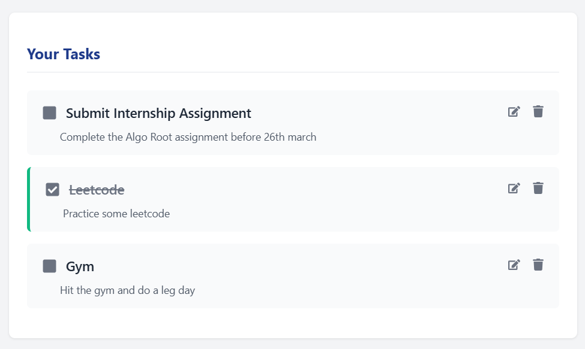

# Task Management Application (Algo Root Internship Assignment Submission)

A full-stack web application for task management built with Next.js (frontend) and Express.js (backend).

**Checkout the live demo** :
- [client](https://task-management-algoroot.vercel.app/)
- [server](https://task-management-algoroot.onrender.app/)

## Features

- Create, read, update, and delete tasks
- Mark tasks as completed
- Responsive design for desktop and mobile devices
- Clean and intuitive user interface

## Tech Stack

### Frontend
- **Next.js**: React framework for server-side rendering
- **React**: JavaScript library for building user interfaces
- **Axios**: HTTP client for API requests
- **React Icons**: Icon library
- **CSS Modules**: For component-scoped styling

### Backend
- **Express.js**: Web application framework for Node.js
- **UUID**: For generating unique identifiers
- **CORS**: For handling cross-origin requests
- **File-based JSON storage**: For data persistence

## Project Structure

```
task-management-app/
├── frontend/             # Next.js frontend
│   ├── components/       # React components
│   ├── pages/            # Next.js pages
│   ├── styles/           # CSS/SCSS styles
│   ├── public/           # Static assets
│   └── utils/            # Helper functions
└── backend/              # Express.js backend
    ├── controllers/      # Route controllers
    ├── models/           # Data models
    ├── routes/           # API routes
    ├── middlewares/      # Custom middlewares
    ├── utils/            # Helper functions
    ├── server.js         # Main server file
    └── data/             # For JSON file storage
```

## Installation and Setup

### Prerequisites
- Node.js (v14 or later)
- npm or yarn

### Backend Setup
1. Navigate to the backend directory:
   ```bash
   cd task-management-app/backend
   ```

2. Install dependencies:
   ```bash
   npm install
   ```

3. Start the development server:
   ```bash
   npm run dev
   ```
   The backend server will run on http://localhost:5000

### Frontend Setup
1. Navigate to the frontend directory:
   ```bash
   cd task-management-app/frontend
   ```

2. Install dependencies:
   ```bash
   npm install
   ```

3. Create a `.env.local` file with the following content:
   ```
   NEXT_PUBLIC_API_URL=http://localhost:5000
   ```

4. Start the development server:
   ```bash
   npm run dev
   ```
   The frontend application will run on http://localhost:3000

## API Documentation

### Endpoints

#### GET /tasks
- **Description**: Retrieve all tasks
- **Response**: Array of task objects
  ```json
  [
    {
      "id": "uuid-string",
      "title": "Task title",
      "description": "Task description",
      "completed": false,
      "createdAt": "ISO date string"
    }
  ]
  ```

#### POST /tasks
- **Description**: Create a new task
- **Request Body**:
  ```json
  {
    "title": "Task title",
    "description": "Task description (optional)"
  }
  ```
- **Response**: Created task object

#### PUT /tasks/:id
- **Description**: Update an existing task
- **URL Parameters**: `id` - Task ID
- **Request Body**: Fields to update
  ```json
  {
    "title": "Updated title",
    "description": "Updated description",
    "completed": true
  }
  ```
- **Response**: Updated task object

#### DELETE /tasks/:id
- **Description**: Delete a task
- **URL Parameters**: `id` - Task ID
- **Response**:
  ```json
  {
    "message": "Task deleted successfully"
  }
  ```

## Error Handling

The API returns appropriate HTTP status codes and error messages:
- `400 Bad Request`: Invalid request data
- `404 Not Found`: Requested resource not found
- `500 Internal Server Error`: Server-side error

## Testing the API

You can test the API using Postman, curl, or any other HTTP client:

### Using curl

#### Get all tasks
```bash
curl http://localhost:5000/tasks
```

#### Create a new task
```bash
curl -X POST http://localhost:5000/tasks \
  -H "Content-Type: application/json" \
  -d '{"title": "Updated Task", "completed": true}'
```

#### Delete a task
```bash
curl -X DELETE http://localhost:5000/tasks/task-id
```

## Screenshots
<div align="center">

 <br><br>
 <br><br>


</div>

## Deployment

### Backend Deployment
1. Update the CORS configuration in `server.js` to allow requests from your frontend domain
2. Deploy to your preferred hosting service (Heroku, Vercel, DigitalOcean, etc.)

### Frontend Deployment
1. Update the `NEXT_PUBLIC_API_URL` environment variable to point to your deployed backend
2. Deploy to Vercel or any other Next.js-compatible hosting service:
   ```bash
   npm run build
   npm run start
   ```

## Future Enhancements
- User authentication
- Task categories/tags
- Due dates for tasks
- Task priority levels
- Sorting and filtering options
- Drag and drop interface
- Dark mode

## License
[MIT](https://github.com/singhchanmeet/AlgoRoot-Assignment/blob/master/LICENSE)
